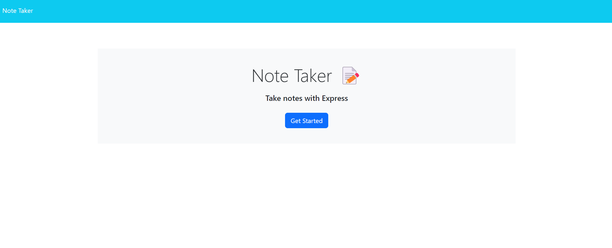
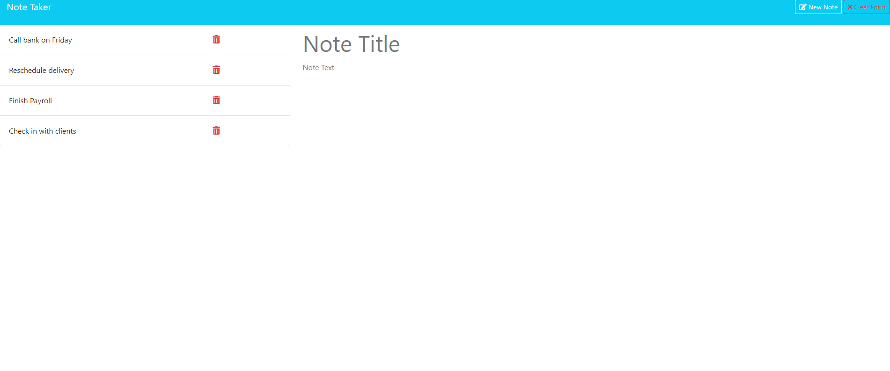
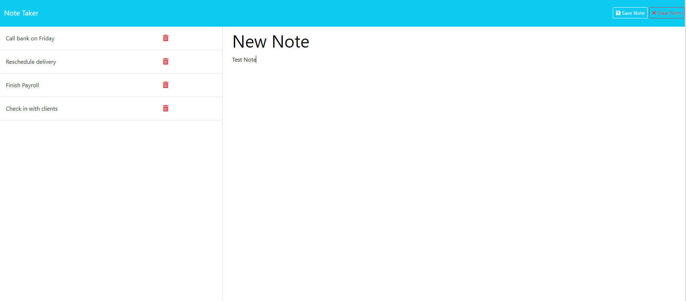

# Note Taker

## Description

The Note Taker application built with Express.js enables users to effortlessly create, save, and delete notes, providing a streamlined note-taking experience.

## Table of Contents

- [Overview](#overview)
- [User Story](#user-story)
- [Acceptance Criteria](#acceptance-criteria)
- [Deployed Application Link](#deployed-application-link)
- [Installation Process](#installation-process)
- [Usage Instructions](#usage-instructions)
- [Key Learnings](#key-learnings)
- [Future Development](#future-development)

## Overview

### The Challenge

The challenge was to create a note-taking application using Express.js to handle the back end, storing and retrieving note data from a JSON file. Additionally, the task involved integrating the back end with the front end and deploying the entire application to Heroku.

## User Story

AS A small business owner
I WANT to be able to write and save notes
SO THAT I can organize my thoughts and keep track of tasks I need to complete

## Acceptance Criteria
GIVEN a note-taking application
WHEN I open the Note Taker
THEN I am presented with a landing page with a link to a notes page
WHEN I click on the link to the notes page
THEN I am presented with a page with existing notes listed in the left-hand column, plus empty fields to enter a new note title and the note’s text in the right-hand column
WHEN I enter a new note title and the note’s text
THEN a Save icon appears in the navigation at the top of the page
WHEN I click on the Save icon
THEN the new note I have entered is saved and appears in the left-hand column with the other existing notes
WHEN I click on an existing note in the list in the left-hand column
THEN that note appears in the right-hand column
WHEN I click on the Write icon in the navigation at the top of the page
THEN I am presented with empty fields to enter a new note title and the note’s text in the right-hand column

## Deployed Application Link

## Installation Process
Clone the repository from GitHub.
(or) Download the zip folder from the GitHub repository.
Open the cloned (or downloaded) repository in any source code editor.
Run NPM "i"
Run NPM Start in Bash terminal

## Key Learnings
Creation of API routes and HTML routes.

## Future Development
Incorporate additional features such as bookmarks, pinned notes, and chapters.
Integrate this note taker into future deployed applications.

## Screenshots

GitHUb Repoistory- https://github.com/hementB2/Note-Taker-Project
Herok Live- https://student-dashboard-1863adfd3b3d.herokuapp.com/